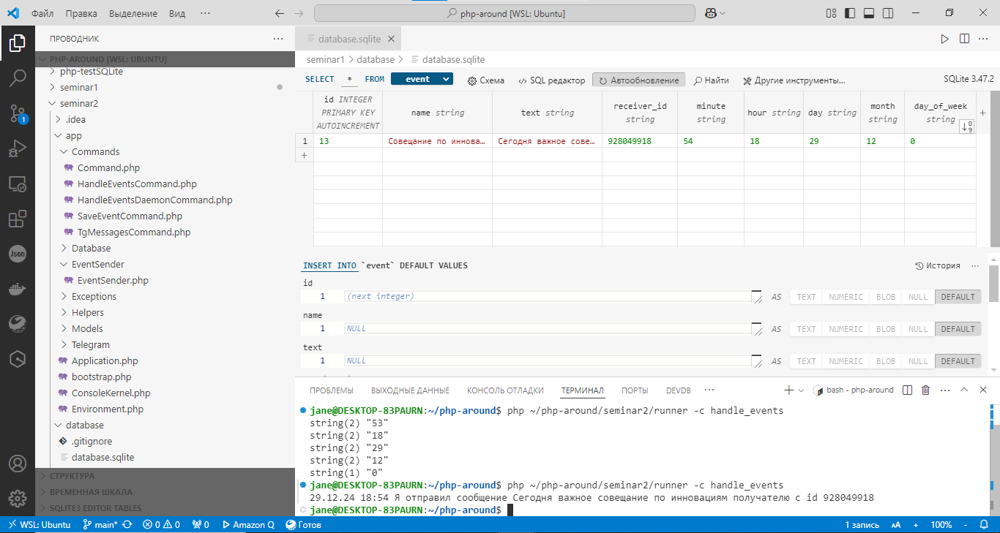
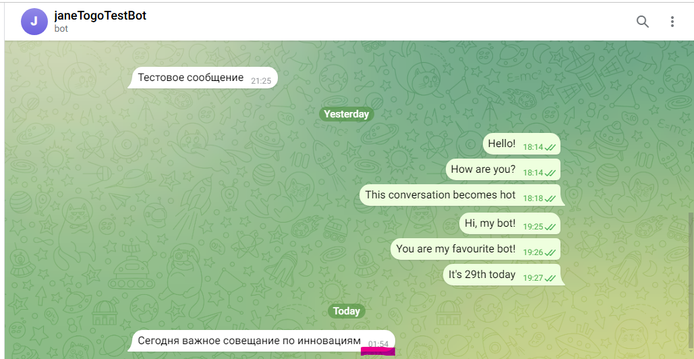
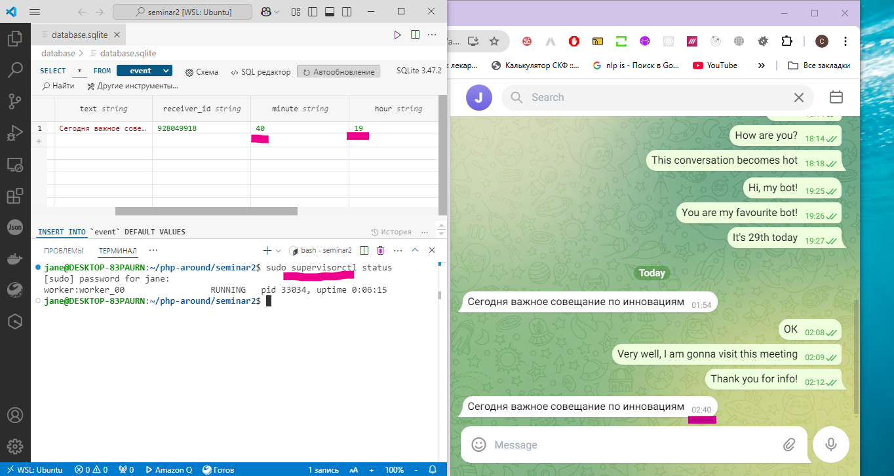
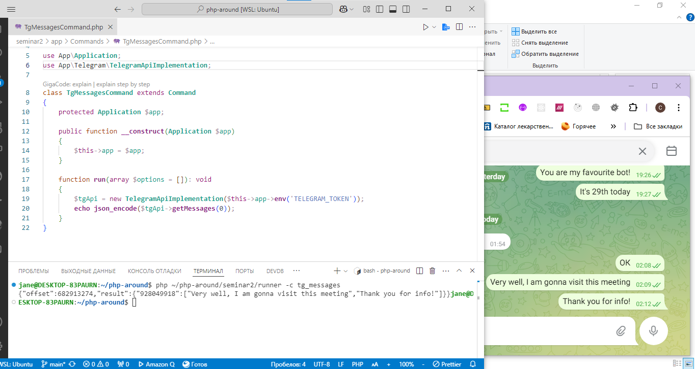

# PHP-AROUND. Homework 2. Тогочакова Евгения
## Backend API
Интеграция с Telegram<br>
1.Реализация отправки сообщений в Telegram<br>
Через команду ```php runner -c handle_events```



Через демона с применением supervisor


2.Реализация получения сообщений из Telegram<br>
Через команду ```php runner -c tg_messages```


3. Сегодня мы работали с вами с токеном Telegram. Какой тип аутентификации мы использовали?<br>
Ответ: Bearer-токен


